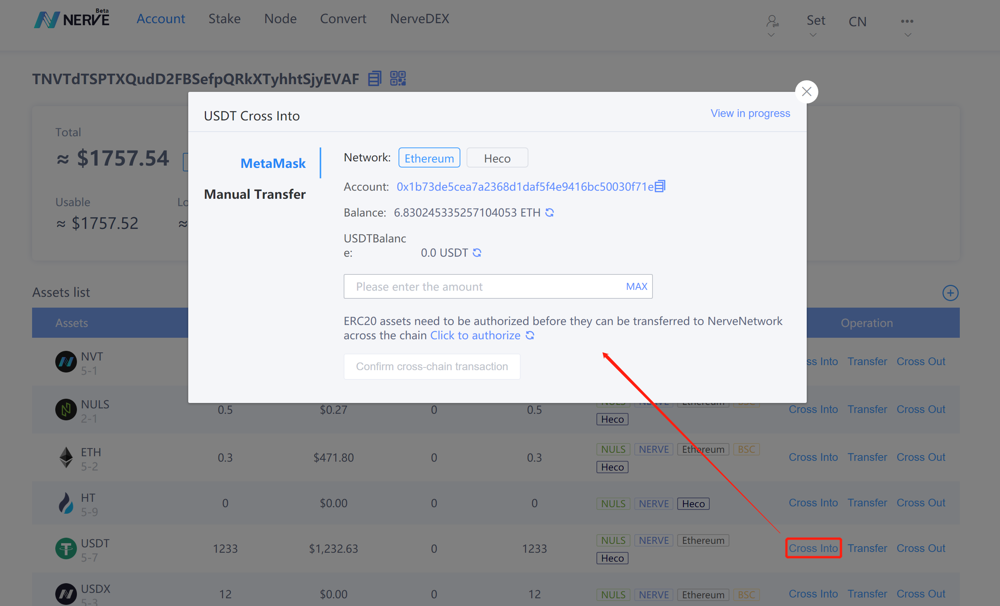
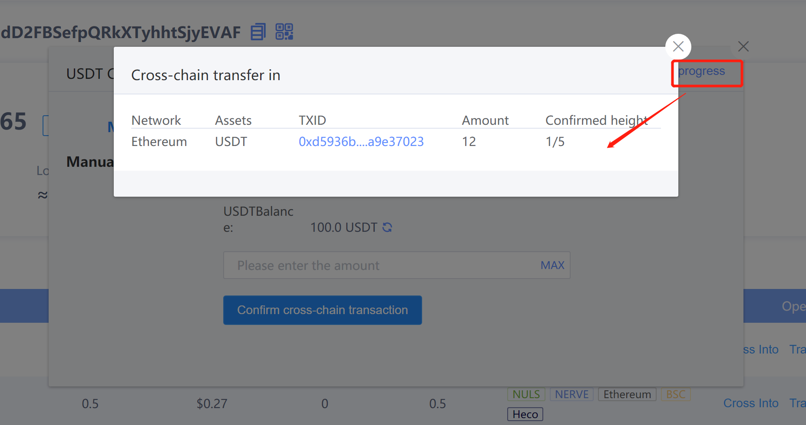
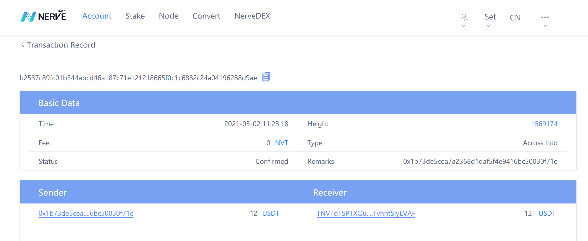
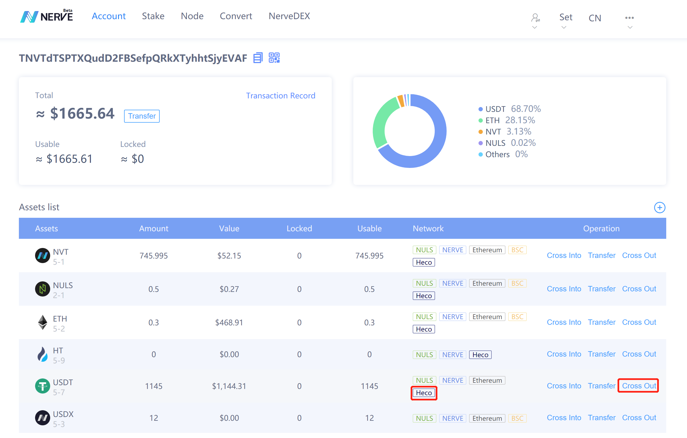
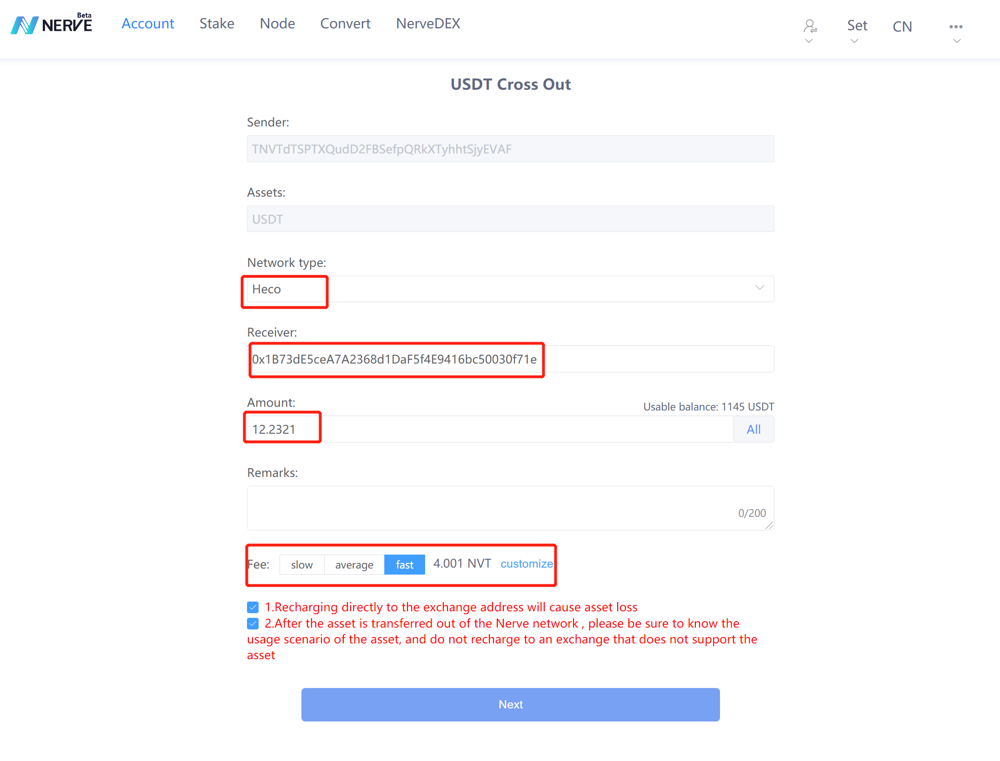
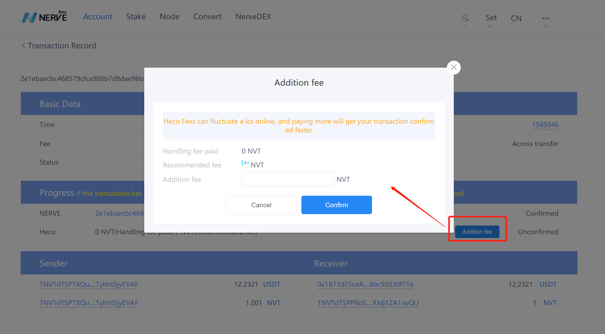
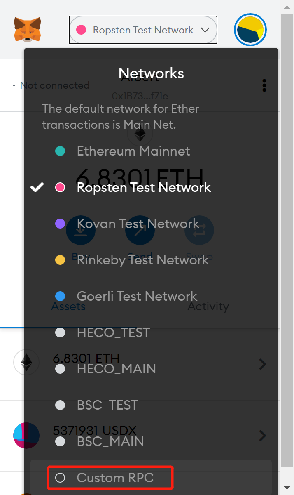
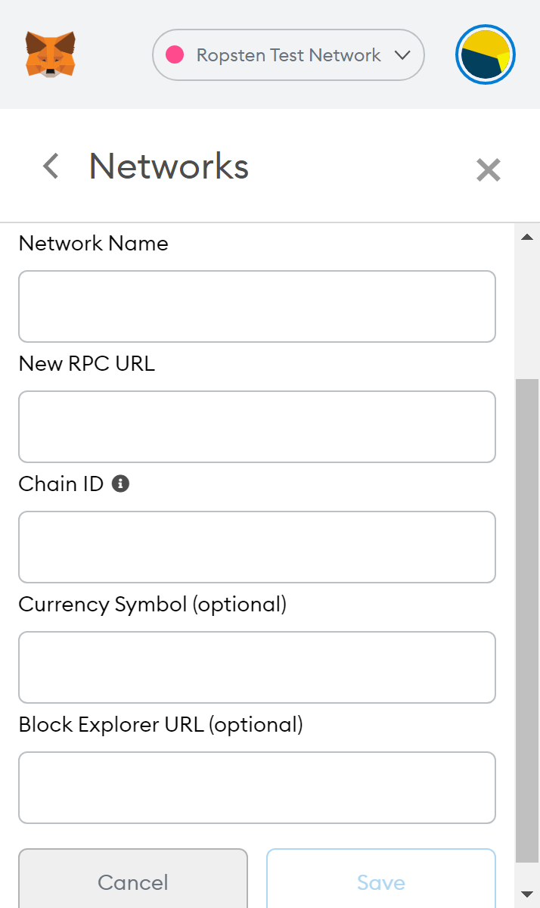
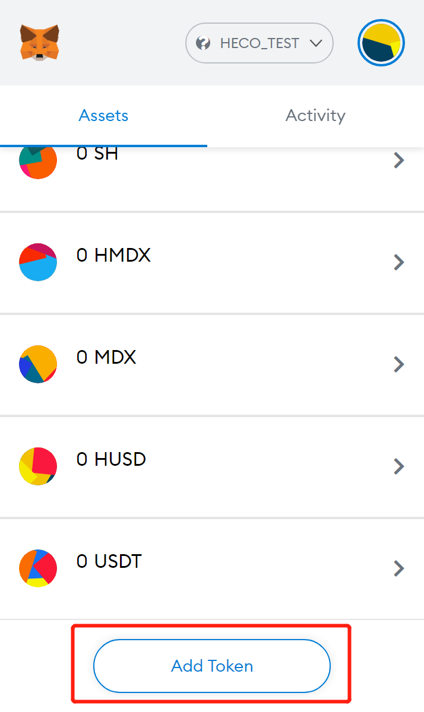
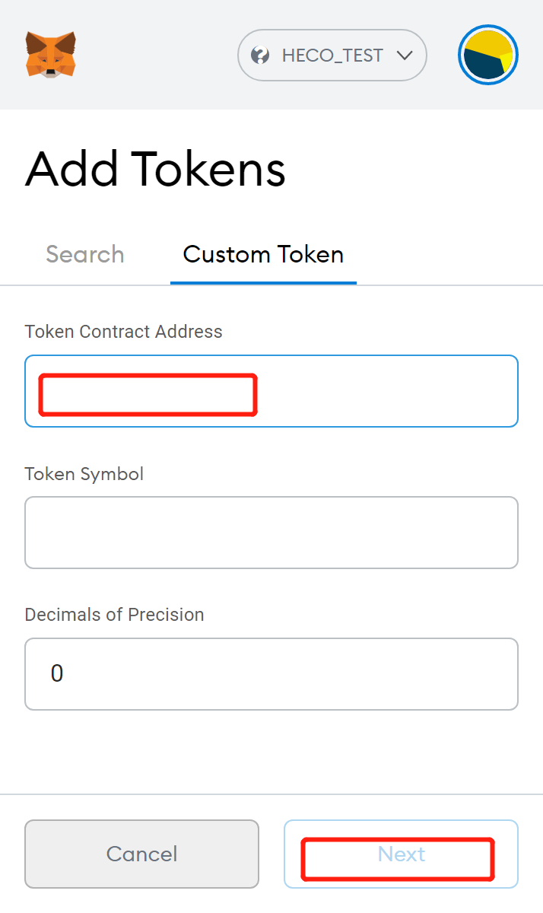

# How assets from ETH network cross chain transferred to the Heco network via NerveNetwork

Nerve network now supports the cross-chain circulation between Ethereum assets and Heco assets. Through the Nerve network, it is possible to provide channels for cross-chain assets of the two chains.This article specifies the wallet as MetaMask and Nerve web wallet (image data is testnet data)	

## Ethereum assets cross-chain transfer into NerveNetwork

To cross-chain ETH assets, you need first to prepare an address with ETH or ERC20 assets, which has been imported into the MetaMask wallet.
Take NVT as an example, enter the Nerve web wallet, select the added NVT, and select cross-chain transfer:	

- The cross-chain transfer window pops up, and authorization is required for the first time.

- After the authorization, click the cross-chain transfer again to pop up the cross-chain transfer window.
- Enter the transfer amount, click to confirm the cross-chain transfer, and wake up MetaMask to initiate the cross-chain transfer transaction.
- After MetaMask confirming the transaction, 30 blocks need to be confirmed by the Nerve network (only 5 for the testnet).
- NVT were successfully transferred into the Nerve network.

This cross-chain transaction can beviewed in the transaction record:

So far,we have completed the cross-chain transfer of USDT from Ethereum to Nerve network. Next step, we
need to transfer the USDT from Nerve network to Heco network.

## Nerve network assets are transferred across the chain to the Heco network

​	Nerve network have completed the assets cross-chain function with the ETH, Heco, and BSC networks.  After all other chain assets enter the Nerve network, they belong to the Nerve network assets. Then, we will take USDT as an example to introduce the Nerve network asset cross-chain transfer into the Heco network.

Similarly, click on the cross-chain transfer:	

Then jump to the cross-chain transfer-out page,select Heco, enter the receiving address and amount, select the gas fee, and then confirm the transaction.

After the transaction is successfully initiated, you will be redirected to the transaction record page, where you can view the progress of the transaction or add gas fees:

After the transaction is successful, you can view the transferred assets in the Heco explorer, or [view the assets on the Heco network in the MetaMask wallet](http://docs.nerve.network/zh/Guide/c_bep20_cross_erc20.html#metamask%E6%9F%A5%E7%9C%8B%E8%B5%84%E4%BA%A7).

## MetaMask custom network

​	Enter MetaMask, click on the network to select custom RPC

After jumping to the custom page, enter the parameter value and save it.

Heco mainnet info：

Network name：Heco_MAIN

chainId：128

RPC URL：https://http-mainnet.Hecochain.com
​		   wss://ws-mainnet.Hecochain.com

Asset symbol：HT

Explorer：https://scan.Hecochain.com

Heco testnet info：

Network name：Heco_TEST

chainId：256

RPC URL：https://http-testnet.Hecochain.com
​		   wss://ws-testnet.Hecochain.com

Asset symbol：HT

Explorer：https://scan-testnet.Hecochain.com

Test coin faucet：https://scan-testnet.Hecochain.com/faucet

## View cross-chain transferred assets in MetaMask

​	After the asset is transferred from the Nerve network to the Heco network, it can be viewed in the MetaMask wallet. You need to obtain the contract address of the asset on the Heco network (you can query it on the Heco explorer through transaction records), add token, and enter the contract address.

## Others
Similarly, the entering of Heco network assets is in the same way as ETH assets enter the Nerve network. Cross-chain transfer in and out realize the circulation of assets between chains, which solve the problem of value circulation between chains effectively .

- Ethereum network cross-chain transfer requires ETH as gas fee.
- Nerve network cross-chain transfer requires NVT as gas fee.
- Heco network cross-chain transfer requires HT as gas fee.

