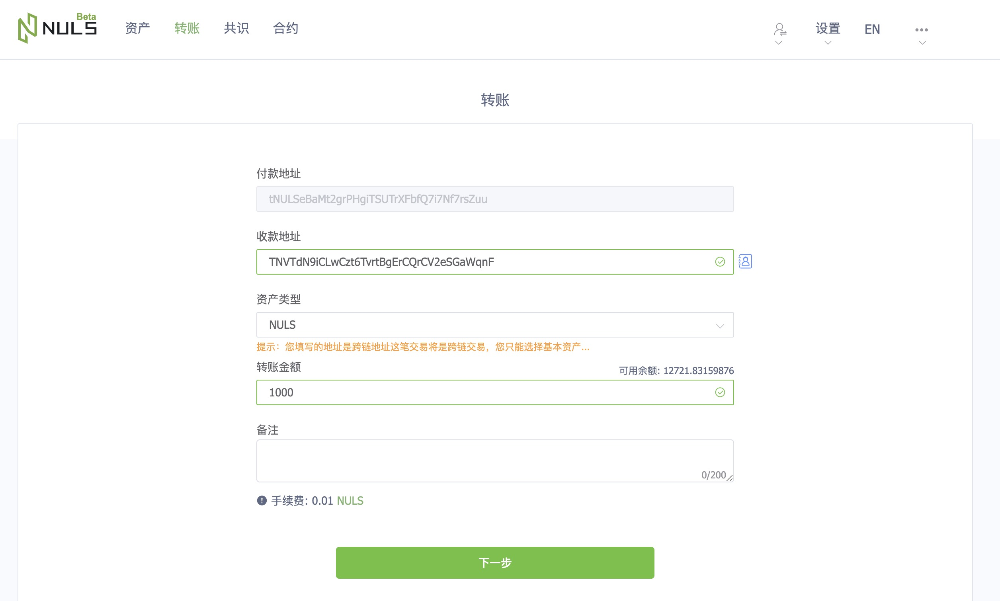
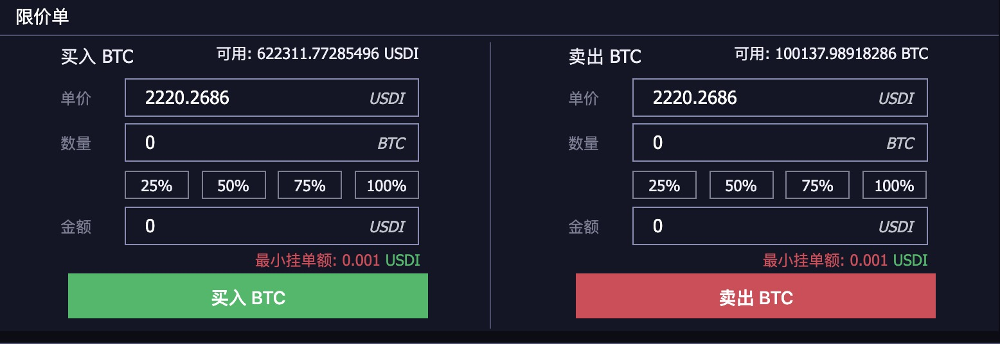

# NDEX Alpha Version instructions

## Preface  
 
 Ndex alpha version access address：[http://beta.nervedex.com](http://beta.nervedex.com)
 
 The full name of ndex is nerve decentralized exchange, and the transaction process is completely controlled by the decentralized node. Therefore, it is different from the conventional centralized transaction. Users should pay attention to the following points when using it:
 - The transaction account is the blockchain account address, so the user needs to save the private key or keystore of the account
 - There is no concept of recharging or withdrawing the assets of the transaction account, only the transfer with the same address as the normal blockchain account
 - Both the registration and cancellation are initiated a transaction, so the transaction fee is required to be paid. Currently, it is 0.001nvt
 - Since both the registration and cancellation are transactions initiated, it is necessary to enter a password to sign the transaction when the registration and cancellation are conducted (the developer will consider the following optimization to improve the experience of everyone's transaction)
 Ndex is now in the * * alpha * * test stage. Welcome to the community user experience and feedback questions. There are two feedback channels:
 
 1 Discord test support：[https://discord.gg/PBkHeD7](http://beta.nervedex.com)
 
 2 Github：[https://github.com/NerveNetwork/nerve/issues](http://beta.nervedex.com)
 
 
 ## Get assets
 
 
 #### Test NVT
 Visit [forum test currency application post] (https://bbs.nuls.io/t/nuls-neve/134) and leave your own nuls test network address. Our developers will transfer the test currency to your address
 
 #### Test NULS
 Visit the wallet of nuls test network: https://beta.wallet.nuls.io/ to enter the [transfer] page, fill in the address of the nerve network in the [collection address], and then transfer the nuls of the test network to the nerve network through the cross chain
 
 
 #### Nuls test network nrc20
 Users can transfer nrc20 of nuls network to the nerve network through cross chain, and conduct transactions on ndex (if the transaction pair of nrc20 has been opened)
 
 [View cross chain nrc20 tutorial](/zh/Guide/c_nrc20.html)
 
 [see how to open the nrc20 transaction pair](./g_nrc_dex.md)
 
 ## Make a deal
 #### Transaction pair
 After obtaining the test token, you can enter the [trading page] of ndex (http://beta.nervedex.com/trading/index) for trading. At present, we have opened the following trading pairs:
 - NVT/BTC
 - NULS/BTC
 - TPU/BTC
 - TPU/USDI
 - NVT/USDI
 - NULS/USDI
 - BTC/USDI
 
 
 In addition, it is worth mentioning that in the beta version, we will open the functions of [issue assets] and [apply for transaction pairs] on the nerve. Please look forward to
 ####  List type
 Currently, we only support price limit list
 
 
 
 ## Service Charge
    There are 4 places where handling fees will be generated when trading on Dex
 - Maker: 0.01% of turnover
 - Taker: 0.01% of turnover
 - Registration form: 0.001nvt
 - Cancellation: 0.001nvt
 
 ## View transaction details
    Ndex is equipped with corresponding browser, which supports query of all transaction details on DEX: http://explorer.nervedex.com/
 
 
