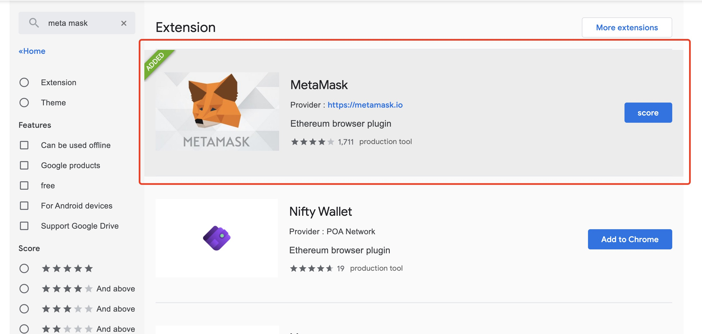
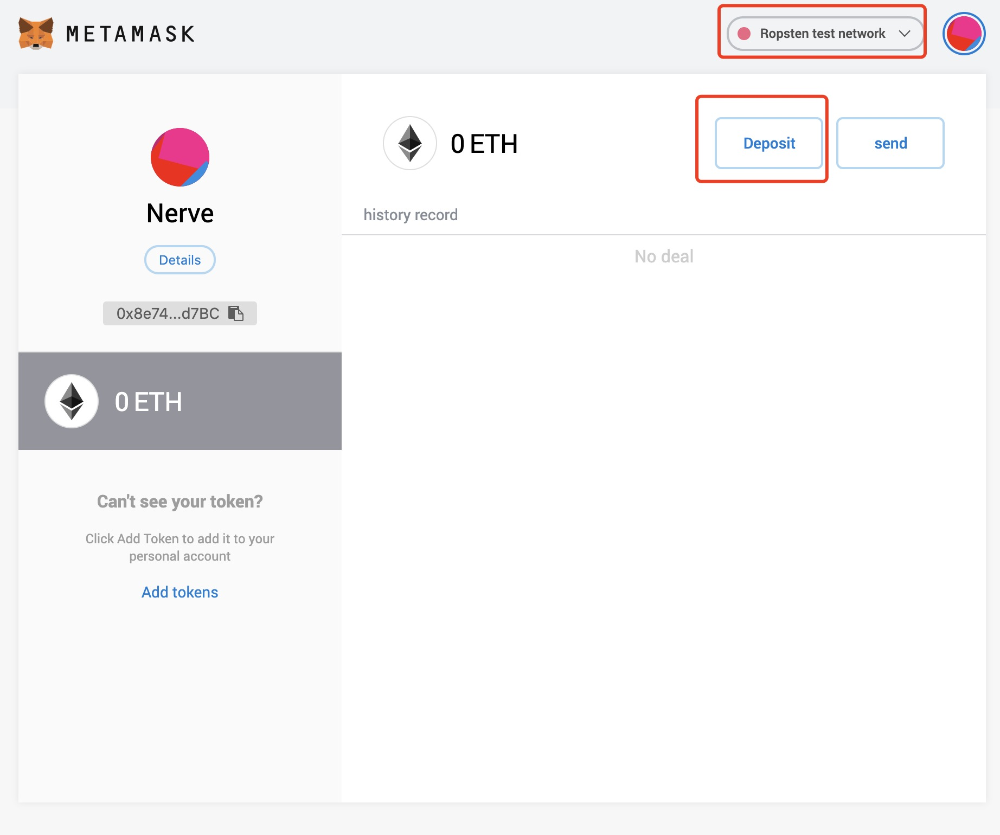
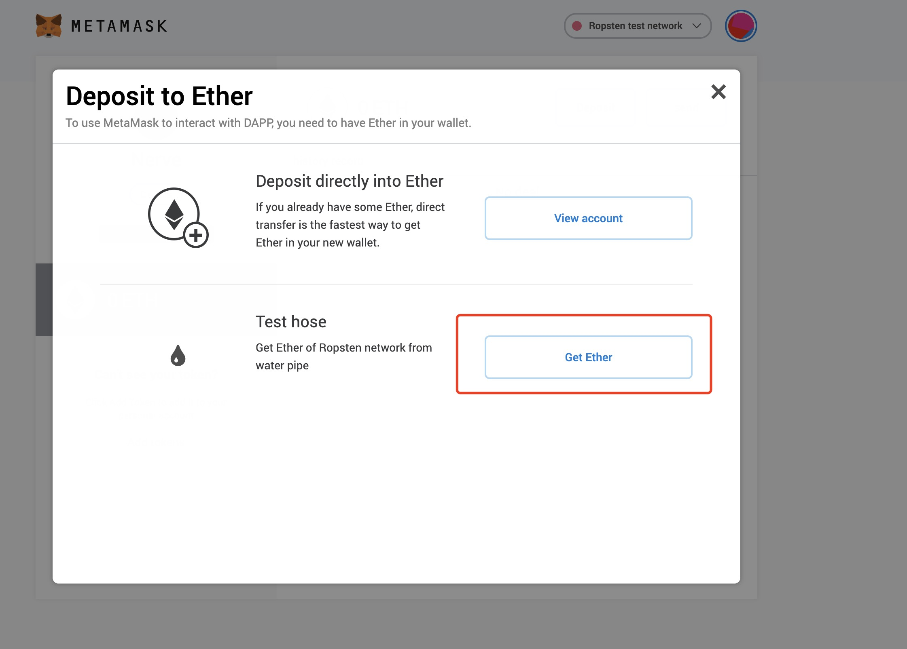

# ETH Cross-chain

The Nerve network is currently in the Beta version, so it is also connected to the ETH test network, so users should pay attention to use the Ethereum test network to make cross-chain transfers to the Nerve test network

## Prepare ETH test coin
Visit [Chrome's App Store](https://chrome.google.com/webstore/search/meta%20mask?utm_source=chrome-ntp-icon), find the Meta mask, and create an Ethereum account

Select **Ropsten** test network, and then click the [Transfer] button

Click[Get Ether]to receive test ETH

## Transfer ETH to Nerve network

Enter Nerve's [Testnet Light Wallet](http://beta.wallet.nerve.network/), on the transfer page, find ETH, click [cross-chain transfer], you can see the entrance, cross-chain transfer to ETH Will be divided into two steps
Click【Get Ether】to receive test ETH

**Step 1:** Transfer ETH to the bound Ethereum account

Each Nerve address has a paired Ethereum account, the private key of the account is the private key of the Nerve account, so the assets of the Ethereum account are still controlled by the user himself

**Step 2:** Confirm cross-chain transfer

After entering the amount of ETH to be transferred in the input box, initiate a transaction, and the ETH in the bound Ethereum account will be transferred from the Ethereum network to the Nerve network through the cross-chain, and the address of the receiving asset is the current Nerve address.

> Tips: If the cross-chain transfer is ERC20 assets, you need to pay attention to whether there is enough ETH to pay transaction fees in the bound Ethereum account (cross-chain transfer also needs to be packaged and traded on the Ethereum network, so it needs to consume ETH)