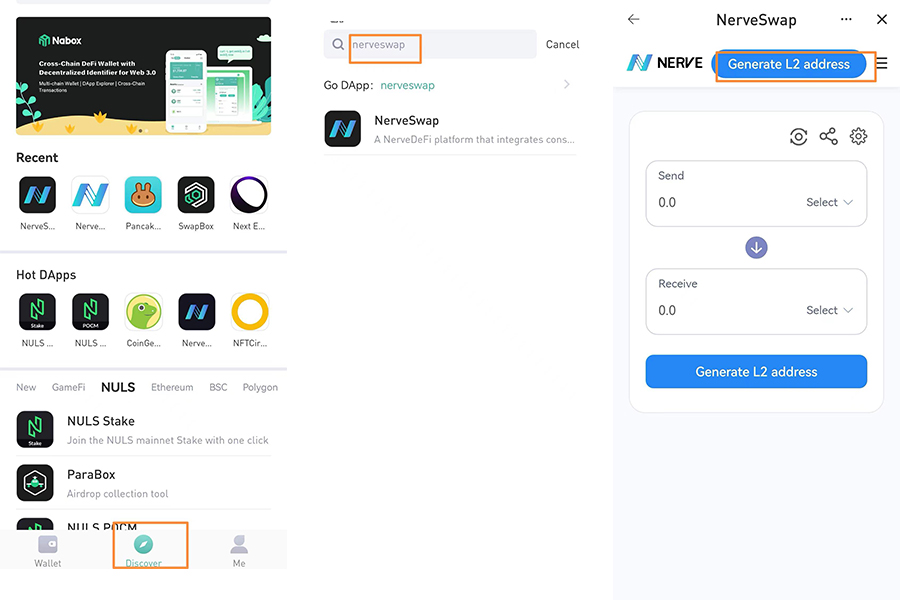
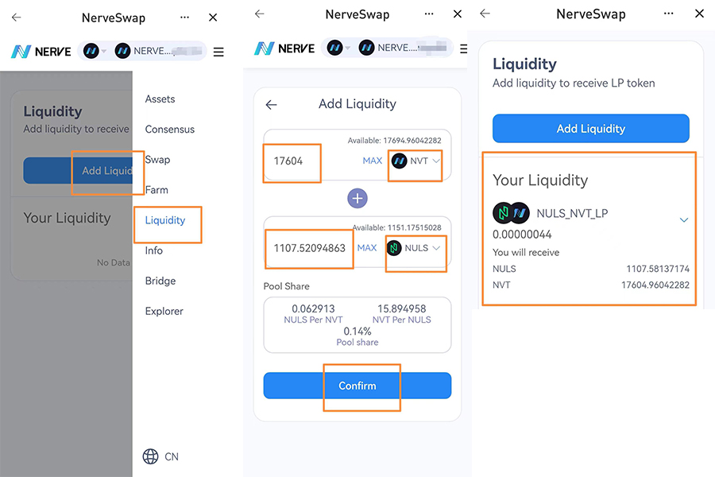
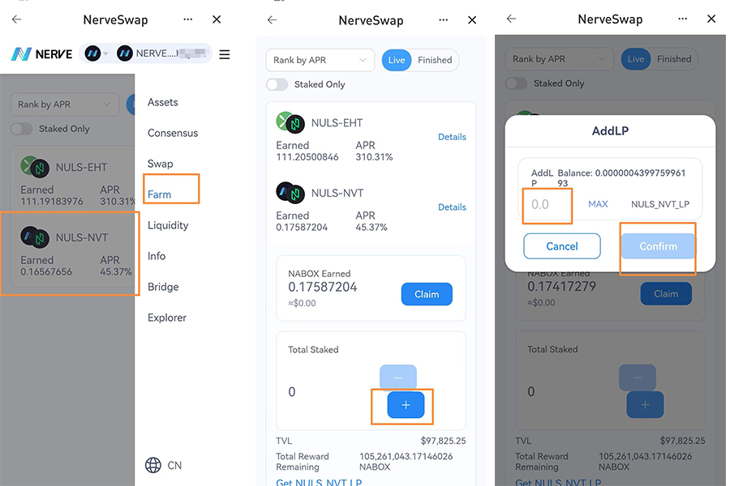
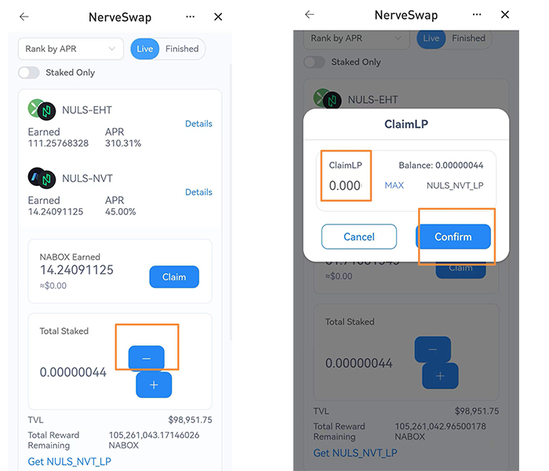
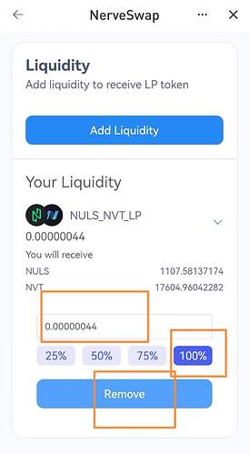

# Adding Liquidity and Farming on NerveSwap

We have deployed some LP farming pools on NerveSwap where our users can stake NULS-NVT LP to min NABOX and NULS-EHT LP to earn EHT. But considering that some users are not experienced well enough in DeFi field, here goes this article guide, we hope this can be some useful educational material on your DeFi journey!

**This article will summarize how to add NULS-NVT LP and Farm on NerveSwap using Nabox mobile app.**

**Make sure you do the following before you provide liquidity:**

* Set up your Nabox wallet account. (Nabox wallet can be downloaded from [nabox.io](http://nabox.io/))
* Make sure you **have enough assets to add liquidity** (NVT, NULS) on **NerveChain.**
* If your NULS and NVT are being kept in other networks (BSC), you need to **crosschain NULS and NVT to NerveChain before adding liquidity.**
* Search NerveSwap on Nabox and enter the DApp.
* Click “**Discover**” — Search “**NerveSwap**” — ”**Generate L2 address**”.

Note: you will be asked to generate an L2 address for authorization for the first time entering.
#

#
## **Provide liquidity for NVT and NULS NerveSwap**

After generating L2 address:

- Click the **top-right** menu
- Select “**Liquidity**”
- “Add Liquidity”
- Select “NVT”
- Enter the amount, then the same worth of NULS will be automatically calculated.
- Click “Confirm” and input your password.

After successfully adding liquidity, your **NULS-NVT LP will be seen on the liquidity page.**

Assets will be **displayed on NerveChain** (NULS & NVT) after your remove the liquidity.

## **How to stake NULS-NVT LP to earn tokens?**

With the liquidity you provide (NULS-NVT LP), you can stake them in NerveFarm to earn free tokens! Here is how:

- Click the top-right meum, select “Farm”
- Select pair “NULS-NVT”
- Click “+”
- Enter the amount of NULS-NVT liquidity you want to stake
- Click “Confirm” and input your pasword.

Till now, you have already staked your NULS-NVT LP in the farming pool, you can harvest the earnings when you want to. To be noted is that there is a fee you need to pay for every harvest.

## **How to unstake LP from NerveFarm**

**Unstake LP farming**

- Click top-right meum
- Select “Farm”
- Select pair “NULS-NVT”
- Click “-”
- Enter the amount of LP you want to unstake
- Click “Confirm” and type password

**Remove Liquidity:**

- Click top-right meum
- Click “Liquidity”
- Find your “NULS-NVT LP”
- Enter the amount of LP you want to remove 
- Click “Remove” 
- Click “Confirm” and input password**

* Assets will be displayed on NerveChain (NULS & NVT) after your remove the liquidity.

There are currently **2 farming pools available on NerveFarm** , which are **NULS-EHT** (earn EHT)and **NULS-NVT** (earn NVT). We will deploye more pools in the soon future!