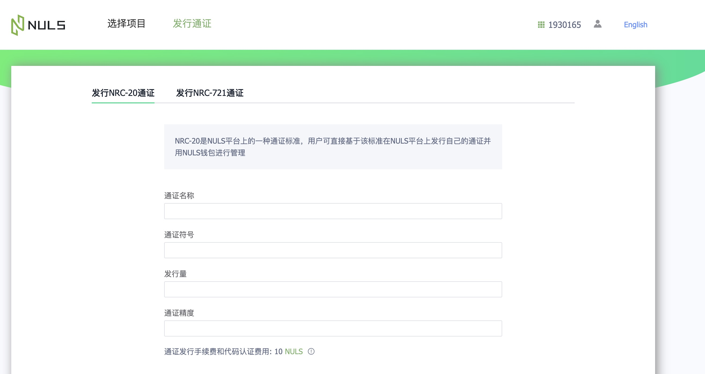

# NRC20 asset launch Dex

## Issue NRC20
Nuls provides pocm platform: https://pocm.nuls.io/token/newtoken supports one click issuance of nrc20 pass
> Pocm address of test network: http://beta.pocm.nuls.io/

## NRC20 asset cross chain
At present, the cross chain of nrc20 token needs to call smart contract in [nuls wallet](http://wallet.nuls.io/), so we have also compiled a detailed [operation tutorial](./c_nrc20.nd)
  
> Nuls test net wallet address: http://beta.wallet.nuls.io/  

In the future, we will also provide a more friendly interactive interface, which is convenient for users who are not familiar with smart contracts to operate easily
## Create transaction pair
If you want to create a transaction pair for nrc20 on ndex, please send an email to pen@nuls.io to submit the application, with the following information:
- Nrc20 name
- Nrc20 contract address
- Name of the pricing currency of the nrc20 transaction pair applied for