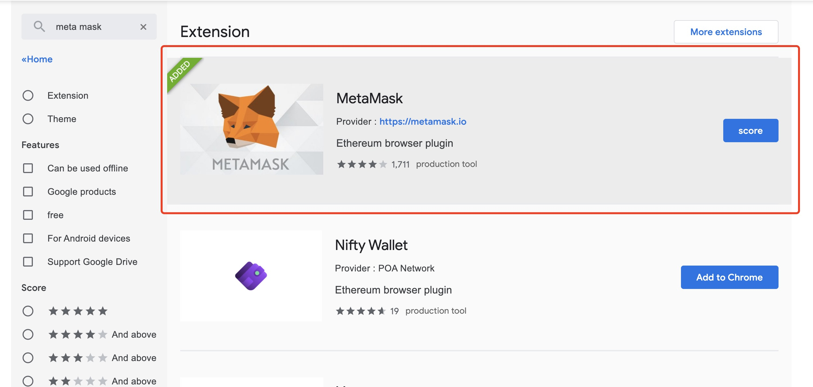

# 以太坊和BSC跨链指南

​	Nerve网络已经完成ETH、BSC资产的跨链工作，你可以把ETH网络的资产通过Nerve网络跨链到BSC网络，也可以把BSC网络资产跨链到ETH网络。

​	BSC网络资产进入ETH网络，在ETH网络是以ERC20资产形式存在。

​	ETH网络资产进入BSC网络，在BSC网络是以BEP20资产形式存在。

## 安装MetaMask插件

访问[Chrome应用商店](https://chrome.google.com/webstore/search/meta%20mask?utm_source=chrome-ntp-icon)，搜索MetaMask，安装该插件

## 选择网络

### ETH网络

打开MetaMask插件，选择以太坊主网络

### BSC网络

打开插件，选择自定义RPC

进入网络编辑页面，添加BSC主网信息

BSC主网字段信息如下：

**Network Name：** BSC_MAIN（用户可以自定义）

**New RPC URL：** https://bsc-dataseed1.defibit.io/

**Chain ID：** 0x38

**Symbol：** BNB

填写完之后点击保存，网络选择BSC_MAIN，即连上了BSC网络。

测试网配置：

**Network Name：** BSC_TEST（用户可以自定义）

**New RPC URL：** https://data-seed-prebsc-2-s1.binance.org:8545/

**Chain ID：** 0x61

**Symbol：** BNB

## ETH资产跨链进入Nerve网络

**注意：** 该操作教程图片为测试网。

### MetaMask（推荐使用）

在MetaMask插件已选择Ehtereum Mainnet，且地址**有ETH和其他ERC20资产**。

新地址在第一次转入ERC20资产时需要进行授权：

授权交易确认之后，刷新钱包即可进行资产跨链转入：

- 选择Ehtereum网络，在输入框内输入不大于资产余额的值；

- 点击“确认跨链转入”按钮，MetaMask会弹出确认窗口；

- 在MetaMask确认该交易，钱包提示交易已发出，需要等待一段时间确认。

等待一段时间之后，就可以在Nerve钱包中查看转入的ETH网络资产。

### 手动转入

在Nerve网页钱包中选择“跨链转入”弹出窗口后：

- 点击手动转入，网络选择Ethereum;
- 向绑定的ETH账户转账ETH（作为交易手续费）和ERC20资产；
- 等待资产到账之后，在输入框内输入不大于余额的数值，点击“确认跨链转入”按钮；
- 弹出密码确认框，输入密码确认，提示交易发起成功，等待一段时间。

等待一段时间后，交易确认，即可在Nerve网页钱包查看资产余额。

## BSC资产跨链进入Nerve网络

**注意：**该操作教程图片为测试网。

### MetaMask（推荐使用）

在MetaMask插件已选择添加的BSC_MAIN网络，且地址**有BNB和其他BEP20资产**。

资产第一次进行跨链转入时需要进行授权，与ETH网络类似。

进入Nerve网页钱包，选择资产点击跨链转入：

- 选择资产，点击跨链转入，弹出窗口；
- 选择BSC网络（MetaMask当前选择BSC网络）；
- 在输入框输入不大于资产余额的数值；
- 点击“确认跨链转入”按钮，MetaMask弹出确认窗口；
- 在MetaMask上面确认交易并点击确认，提示交易发出请等待。

等待一段时间之后，就可以在Nerve钱包中查看转入的BSC网络资产。

### 手动转入

在Nerve网页钱包中选择“跨链转入”弹出窗口后：

- 点击手动转入，网络选择BSC;
- 向绑定的BSC账户转账BNB（作为交易手续费）和BEP20资产；
- 等待资产到账之后，在输入框内输入不大于余额的数值，点击“确认跨链转入”按钮；
- 弹出密码确认框，输入密码确认，提示交易发起成功，等待一段时间。

等待一段时间后，交易确认，即可在Nerve网页钱包查看资产余额。

## 查看进行中转入

跨链资产转入交易发起成功后，等待确认后，可以查看进行中的转入交易

## ETH资产、BSC资产从Nerve网络跨链转出到ETH网络、BSC网络

### 跨链转出

在Nerve网页钱包中，Nerve地址已经有转入的NVT（跨链转出手续费）、ETH资产、BSC资产，你可以在钱包中选择任意一个资产点击跨链转出

点击跨链转出之后，跳转到跨链转出页面

- 资产为选择跨链转出的资产；
- 选择跨链转出的网络类型：ETH和BNB，分别表示资产跨链转出到ETH网络和资产跨链转出到BSC网络；
- 接收地址：跨链转出网络的接收地址（根据网络类型填写ETH地址和BSC地址）；
- 金额：跨链转出金额；
- 手续费：默认为中，提供三个等级供选择，也可以自定义手续费；
- 勾选提示；
- 点击下一步，弹出密码确认框；
- 输入密码确认后，提示交易发出，跳转到交易详情页面，可以查看交易信息，等到一段时间后，网络确认交易，就可以在网络中查看资产。

### MetaMask查看资产：

资产跨链转出成功之后，可以通过MetaMask查看资产余额

在MetaMask选择网络之后（ETH网络或BSC网络），添加跨链转出资产在该网络对应的token合约

输入合约地址，加载出信息之后，点击“NEXT”

点击“Add Tokens”

返回MetaMask首页，资产添加成功。

### BSC网络、ETH网络对应资产合约

BSC网络：

- NVT:0xf0E406c49C63AbF358030A299C0E00118C4C6BA5
- NULS:0x8CD6e29d3686d24d3C2018CEe54621eA0f89313B

ETH网络：

- NVT: 0x7b6F71c8B123b38aa8099e0098bEC7fbc35B8a13
- NULS: 0xa2791BdF2D5055Cda4d46EC17f9F429568275047

## 其他

### 测试网

[Nerve网页钱包测试网](http://beta.wallet.nerve.network/)

[Nerve浏览器测试网](http://beta.scan.nerve.network/)

[ETH浏览器测试网](https://ropsten.etherscan.io/)

[BSC浏览器测试网](https://testnet.bscscan.com/)

### 主网

[Nerve网页钱包](https://wallet.nerve.network/)

[Nerve浏览器](https://scan.nerve.network/)

[ETH浏览器](https://etherscan.io/)

[BSC浏览器](https://bscscan.com/)

### 说明

ETH资产跨链到BSC网络：ETH资产跨链转入到Nerve网络，在Nerve网络跨链转出该资产到BSC网络；

BSC资产跨链到ETH网络：BSC资产跨链转入到Nerve网络，在Nerve网络跨链转出该资产的ETH网络；

ETH资产跨链转入需要ETH作为手续费发起交易；

BSC资产跨链转入需要BNB作为手续费发起交易；

资产在Nerve网络流通需要NVT作为手续费，跨链转出需要NVT作为手续费发起交易。

