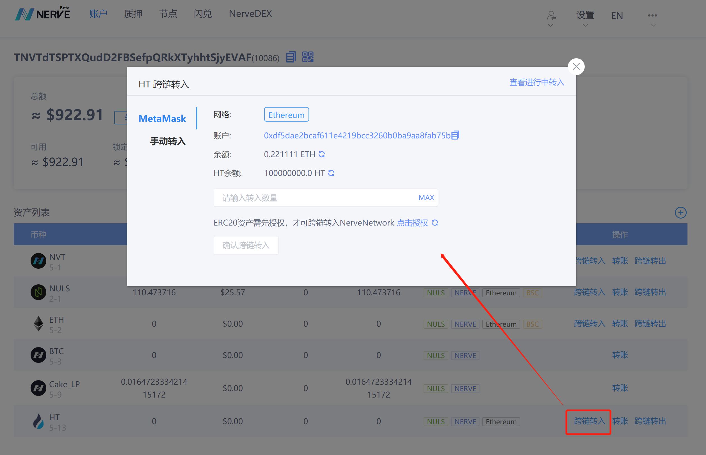
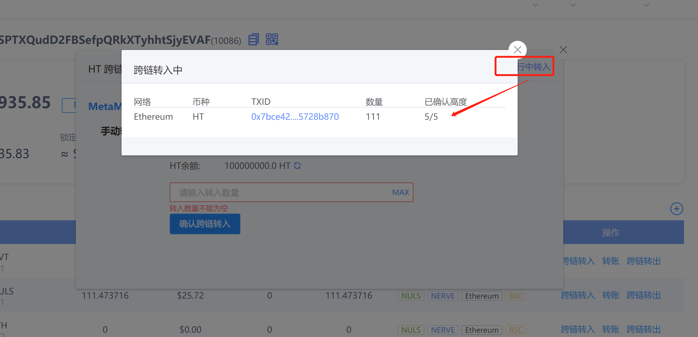
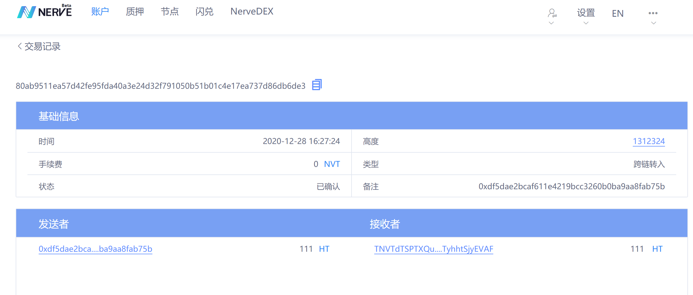
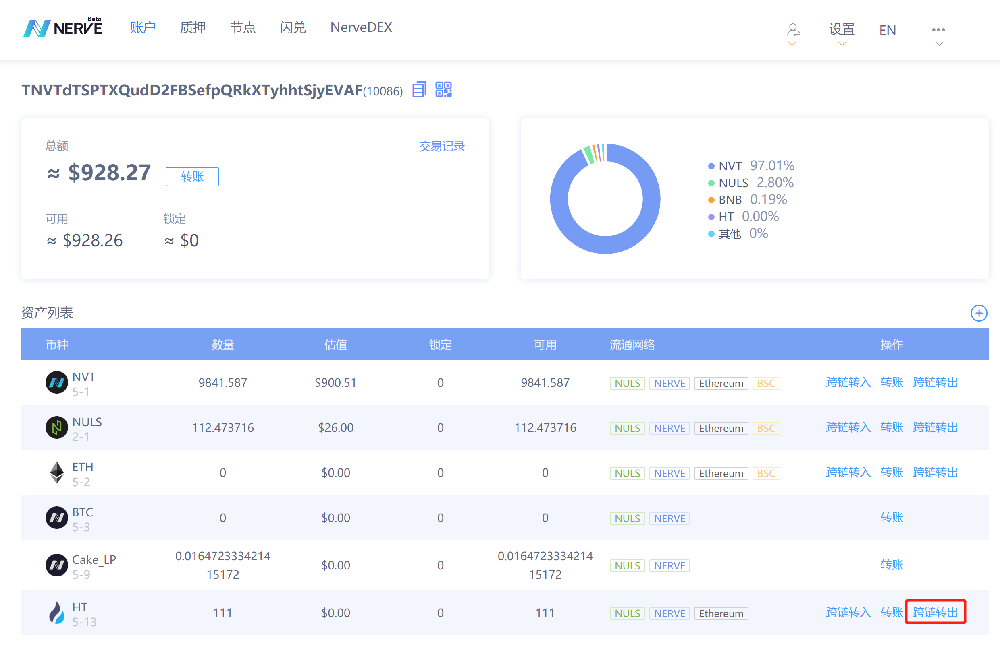
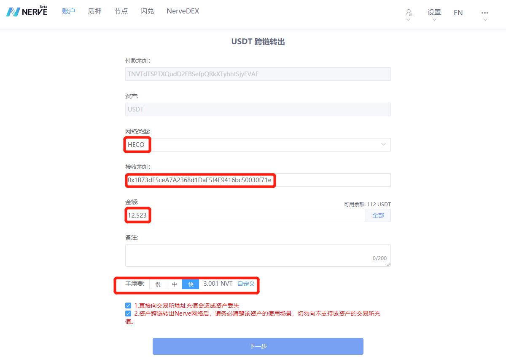
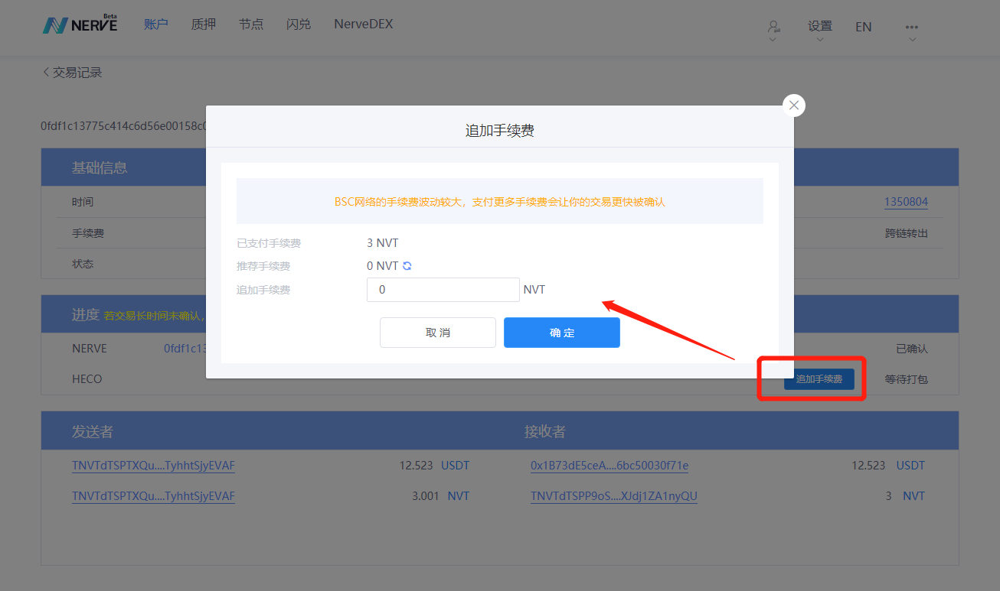
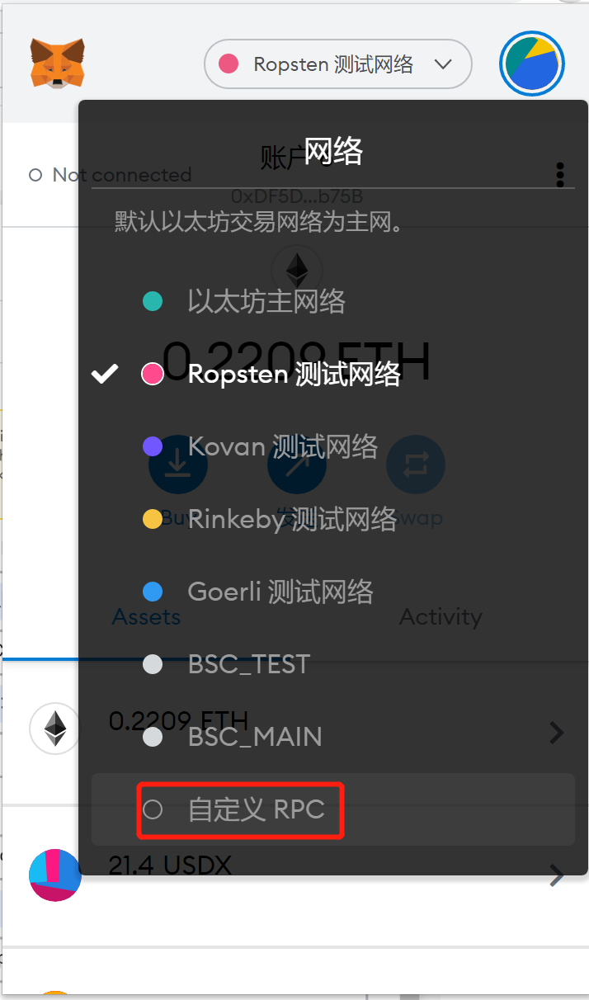
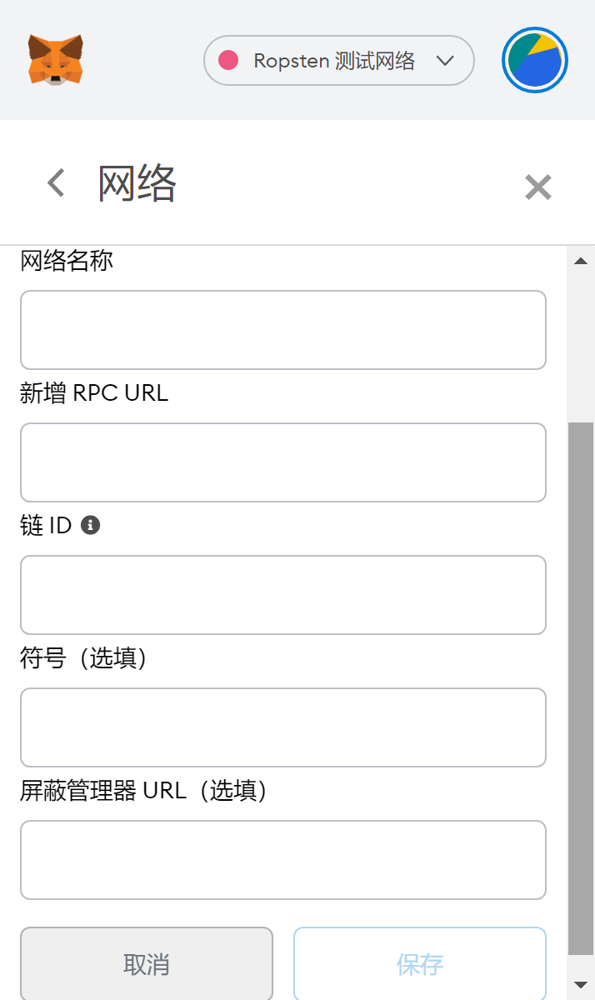
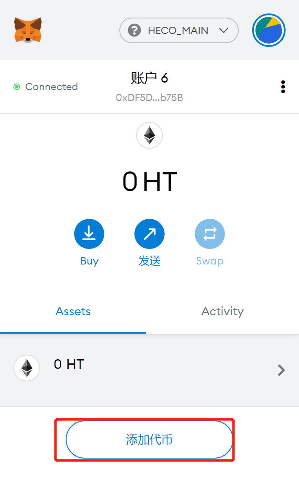
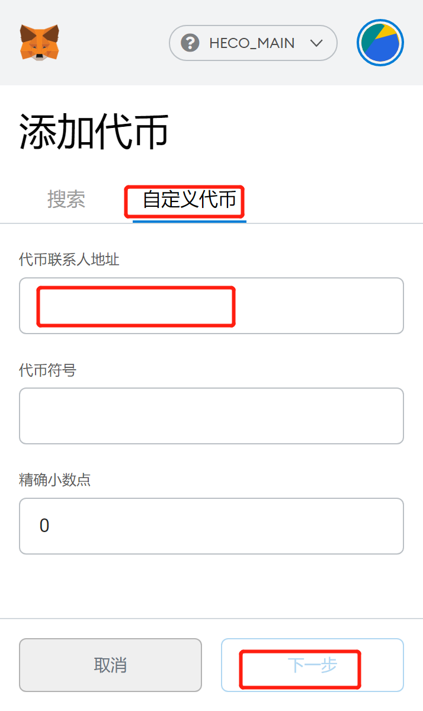

# ETH资产通过Nerve网络跨链转入HECO网络

​	Nerve网络现已支持ETH资产和HECO网络资产跨链流通，通过Nerve网络可以为两条链的资产跨链提供通道，本文指定钱包为[MetaMask](http://docs.nerve.network/zh/Guide/c_bep20_cross_erc20.html)和[Nerve网页钱包](https://wallet.nerve.network/)（图片数据为测试网数据）

## ETH资产跨链转入Nerve网络

​	要进行ETH资产的跨链，首先得准备一个拥有ETH或ERC20资产的地址，该地址已导入MetaMask钱包。

​	以USDT为例，进入Nerve网页钱包，选择已添加的USDT资产，选择跨链转入：

弹出跨链转入窗口，第一次需要先进行授权，授权成功之后再次点击跨链转入弹出跨链转入窗口，输入转入数量，点击确认跨链转入，唤醒MetaMask发起跨链转入交易，带交易确认之后Nerve网络确认30个区块（测试网为5），USDT资产成功跨链转入Nerve网络：

可以在交易记录中查看这笔跨链交易：

至此，我们完成了USDT资产跨链转入Nerve网络，接下来需要将跨链转入USDT跨链转出到HECO网络。

## Nerve网络资产跨链转出到HECO网络

​	目前Nerve网络和ETH、HECO、BSC网络都完成了资产跨链功能，所有其他链的资产进入Nerve网络之后都属于Nerve网络资产，接下来还是以USDT为例，介绍Nerve网络资产跨链转出到HECO网络。

​	同样，点击资产列表中的USDT资产后面的跨链转出：

跳转到跨链转出页面，选择网络为：HECO，输入接收地址、跨链转出数量，选择手续费，然后确认交易

交易发起成功之后跳转到交易记录页面，在这个页面可以查看交易的进展或追加手续费：

交易成功之后，可以在HECO浏览器查看转入的资产，也可以在[MetaMask钱包查看HECO网络上的资产](http://docs.nerve.network/zh/Guide/c_bep20_cross_erc20.html#metamask%E6%9F%A5%E7%9C%8B%E8%B5%84%E4%BA%A7)

## MetaMask自定义网络

​	进入MetaMask，点击网络选择自定义RPC

跳转到自定义页面之后输入参数值报错即可

HECO主网信息：

网络名称：HECO_MAIN

chainId：128

RPC URL：https://http-mainnet.hecochain.com
​		   wss://ws-mainnet.hecochain.com

资产符号：HT

浏览器：https://scan.hecochain.com

HECO测试网信息：

网络名称：HECO_TEST

chainId：256

RPC URL：https://http-testnet.hecochain.com
​		   wss://ws-testnet.hecochain.com

资产符号：HT

浏览器：https://scan-testnet.hecochain.com

测试币水龙头：https://scan-testnet.hecochain.com/faucet

## 在MetaMask中查看跨链转入的资产

​	资产从Nerve网络转入HECO网络之后，在MetaMask钱包可以查看，需要获取该资产在HECO网络的合约地址（通过交易记录可以在HECO浏览器上面查询），添加代币，输入合约地址即可。

## 其他

​	同样HECO网络资产进入Nerve网络跟ETH资产进入Nerve网络方法一样，跨链转入和跨链转出实现了链与链之间的资产流通，有效的解决了链之间的价值流通问题。

- 以太坊网络跨链转入需要ETH作为交易手续费
- Nerve网络跨链转出需要NVT作为交易手续费
- HECO网络跨链转入需要HT作为交易手续费

