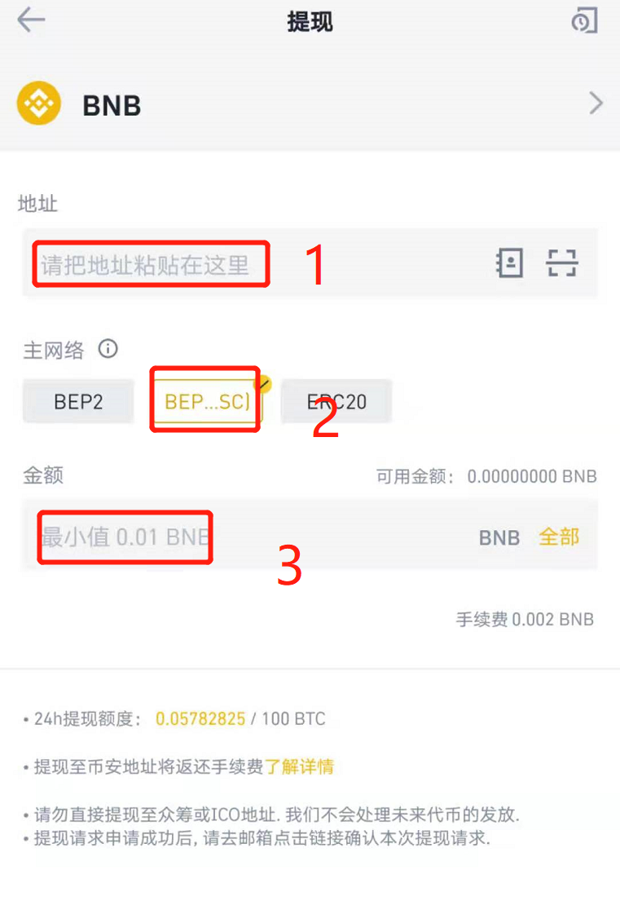
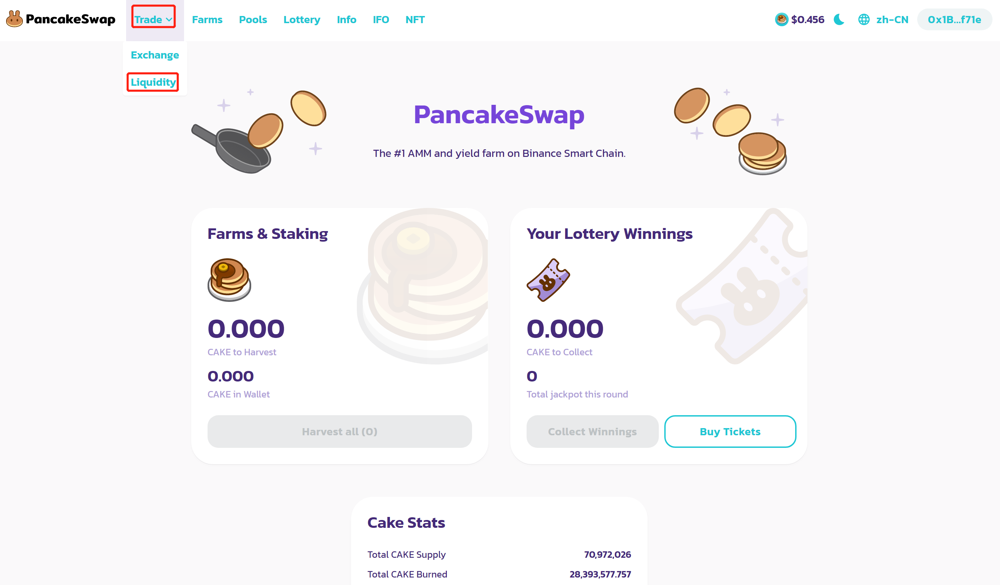
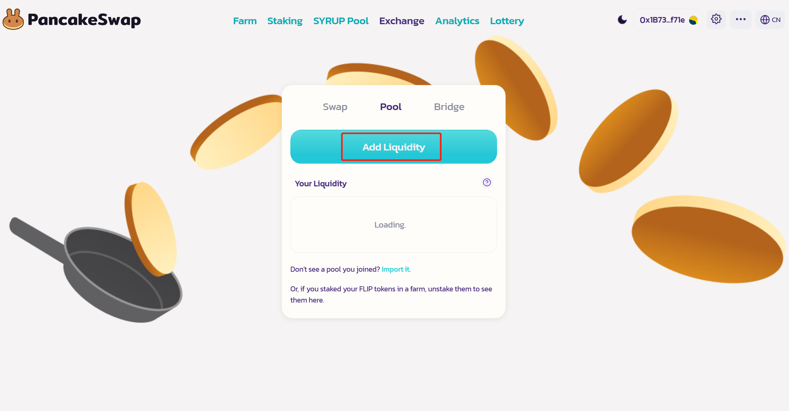
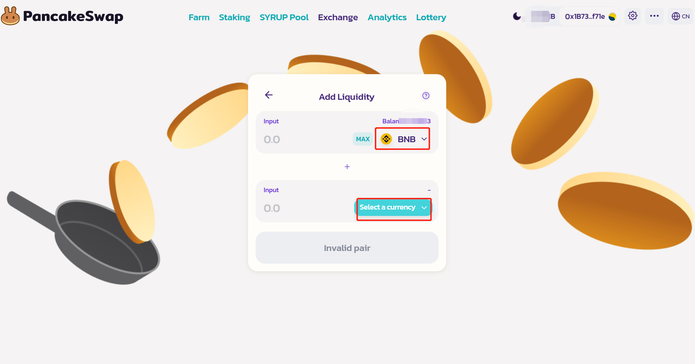
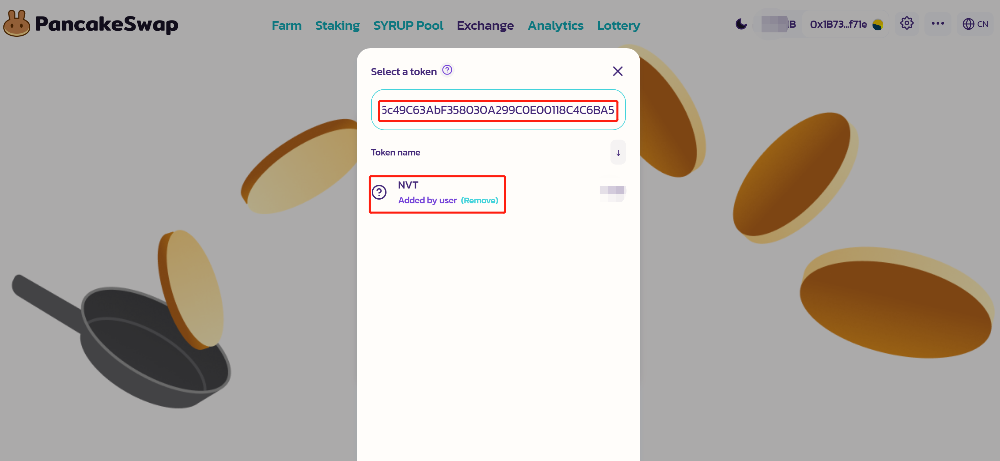
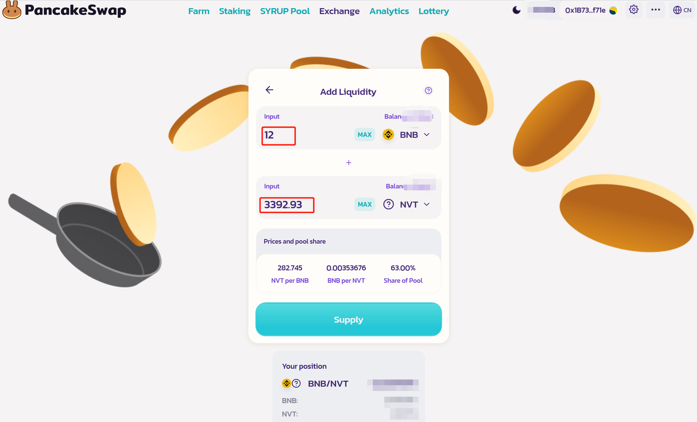
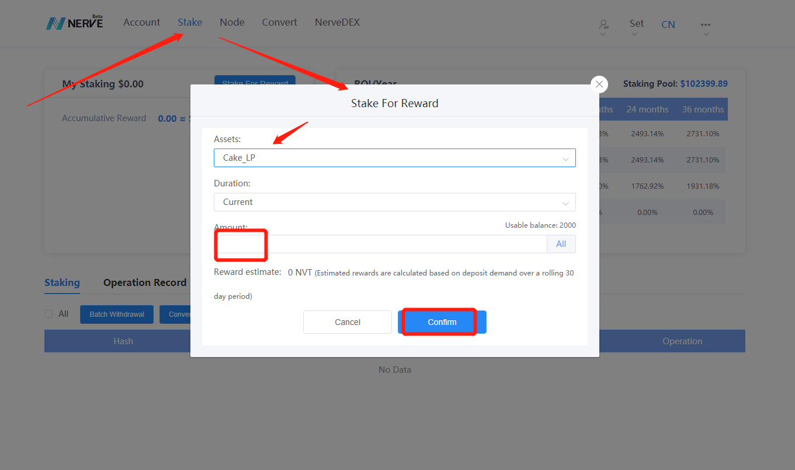

# LP参与Nerve网络staking

​	Nerve网络现已支持LP参与staking获取NVT奖励，目前支持的LP有Cake-LP、UNI-V2，具体LP的收益率可以在[Nerve钱包](https://wallet.nerve.network/)和[Nerve浏览器](https://scan.nerve.network/)查看。

## 资产准备（以BNB为例）

​	添加WBNB-NVT的流动性需要BNB和NVT两种资产，且这两种资产需要同在BSC网络上。

[使用MetaMask连接BSC主网](http://docs.nerve.network/zh/Guide/c_bep20_cross_erc20.html#bsc%E7%BD%91%E7%BB%9C)，创建BSC网络地址，从交易所提现BNB到该地址

- （1）将BSC地址填入地址输入框；
- （2）选择主网络为BEP20（BSC）；
- （3）输入提现金额；

完成BNB提现之后，通过Nerve网页钱包可以[跨链转出NVT到BSC网络](http://docs.nerve.network/zh/Guide/c_bep20_cross_erc20.html#eth%E8%B5%84%E4%BA%A7%E3%80%81bsc%E8%B5%84%E4%BA%A7%E4%BB%8Enerve%E7%BD%91%E7%BB%9C%E8%B7%A8%E9%93%BE%E8%BD%AC%E5%87%BA%E5%88%B0eth%E7%BD%91%E7%BB%9C%E3%80%81bsc%E7%BD%91%E7%BB%9C)

**BSC网络NVT合约地址：** 0xf0e406c49c63abf358030a299c0e00118c4c6ba5

可以通过合约地址添加Token，在MetaMask中查看BSC网络上NVT数量。

BNB和NVT资产准备就绪之后，就可以去添加流动性获取Cake-LP了。

## 获取LP（以Cake-LP为例）

​	在BSC网络上准备好BNB和NVT之后，就可以去添加流动性获取Cake-LP了，[进入PancakeSwap](https://pancakeswap.finance/)，连接MetaMask钱包并授权，选择准备好资产的地址连接。

​	准备就绪之后，选择Trade下的Liquidity：

进入添加流动性页面：

点击Add Liquidity

上面的input选择BNB，同时会显示BNB余额，再点击Select a currency，弹出资产选择窗口，输入NVT在BSC网络的合约地址：0xf0e406c49c63abf358030a299c0e00118c4c6ba5，搜索选择资产：

选择好资产之后，输入想要参与流动性的数量，参与流动性（第一次需要点击Approve NVT进行授权，授权成功之后再点击Supply添加）

确认好资产之后点击Supply，弹出确认窗口，点击Confirm Supply，会唤醒MetaMask确认发送交易，在MetaMask上面确认之后等待交易确认即可获取到Cake-LP。**Cake-LP的合约地址为** 0xee31a8bb1edb26d8de688e2a1ca086e5c11f5978，可以在MetaMask上面添加Token查看余额。

至此，Cake-LP成功获取，接下来就是将Cake-LP跨链转入Nerve网络参与Staking。

## Cake-LP参与staking

获取Cake-LP之后，需要把Cake-LP[跨链转入到Nerve网络](http://docs.nerve.network/zh/Guide/c_bep20_cross_erc20.html#bsc%E8%B5%84%E4%BA%A7%E8%B7%A8%E9%93%BE%E8%BF%9B%E5%85%A5nerve%E7%BD%91%E7%BB%9C)

当Cake-LP成功转入Nerve网络之后，就可以使用其参与Staking获取NVT奖励了：

进入stake页面，点击“Stake For Reward”，弹出窗口选择资产为“Cake-LP”，输入质押的数量点击“Confirm”确认，输入密码发起交易，交易确认之后即参与staking成功，等待奖励发放。

## UNI-V2参与Nerve网络staking

​	UNI-V2是在UNIswap上面参与ETH-NVT流动性产生的Token，其操作与Cake-LP类似，**NVT在Ethereum网络的合约：** 0x7b6f71c8b123b38aa8099e0098bec7fbc35b8a13

[NVT资产从Nerve网络跨链转出到Ethereum网络](http://docs.nerve.network/zh/Guide/c_bep20_cross_erc20.html#eth%E8%B5%84%E4%BA%A7%E3%80%81bsc%E8%B5%84%E4%BA%A7%E4%BB%8Enerve%E7%BD%91%E7%BB%9C%E8%B7%A8%E9%93%BE%E8%BD%AC%E5%87%BA%E5%88%B0eth%E7%BD%91%E7%BB%9C%E3%80%81bsc%E7%BD%91%E7%BB%9C)

## 如何获取NVT

NVT可以在交易所获取：MXC、Bittrex、BitZ、[NerveDEX](http://nervedex.com/)等；

也可以在[PancakeSwap](https://exchange.pancakeswap.finance/?_gl=1*yfh8cv*_ga*MTgyNTc0Mzg2NC4xNjA1NTIwNzc2*_ga_334KNG3DMQ*MTYwNzU4NDY3NC4xNS4xLjE2MDc1ODQ2NzkuMA..#/swap?inputCurrency=0xbb4cdb9cbd36b01bd1cbaebf2de08d9173bc095c&outputCurrency=0xf0e406c49c63abf358030a299c0e00118c4c6ba5)和[Uniswap](https://app.uniswap.org/#/swap?inputCurrency=0x7b6f71c8b123b38aa8099e0098bec7fbc35b8a13&outputCurrency=ETH)中交易换取。