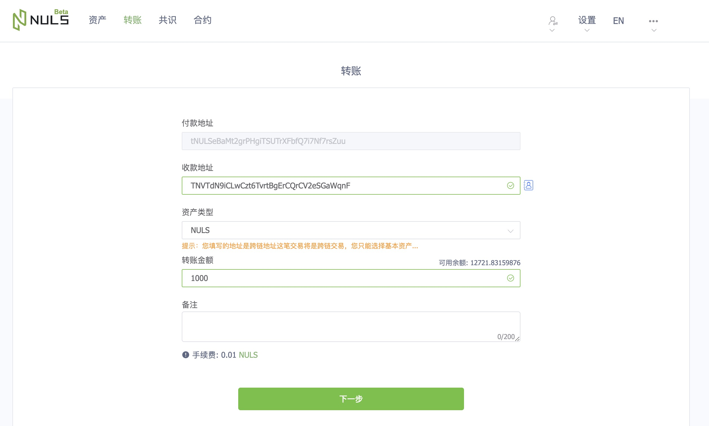
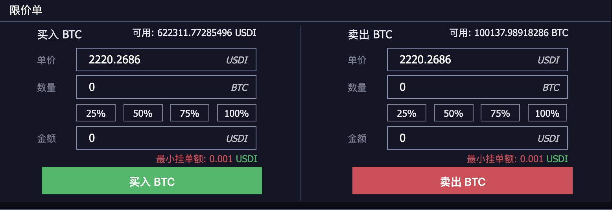

# NDEX Alpha版本使用说明

## 前言

NDEX Alpha版本访问地址：[http://beta.nervedex.com](http://beta.nervedex.com)

NDEX全称为Nerve去中心化交易所，完全由去中心化节点控制交易流程，因此其与常规的中心化交易所有一定的区别，用户在使用时需注意以下几点：
- 交易账户即为区块链账户地址，因此用户需保存好账户的私钥或keystore
- 交易账户的资产没有充值或者提现的概念，只有和正常区块链账户地址一样的转账
- 挂单和撤单都是发起一笔交易，因此需支付交易手续费，目前为0.001NVT
- 由于挂单和撤单都是发起一笔交易，因此在挂单和撤单时都需输入密码对交易进行签名（开发人员会考虑后续对此处进行优化，以提升大家交易的体验性）

NDEX现在处于**Alpha**测试阶段，欢迎各位社区用户体验并反馈问题，反馈渠道有两个：

1 Discord测试支持：[https://discord.gg/PBkHeD7](http://beta.nervedex.com)

2 Github：[https://github.com/NerveNetwork/nerve/issues](http://beta.nervedex.com)

## 获取测试币

#### 测试的NVT
访问[论坛测试币申请帖](https://bbs.nuls.io/t/nuls-nerve/134)留言自己的NULS测试网络地址，我们的开发人员会将测试币转入你的地址

#### 测试NULS
访问NULS的测试网钱包：https://beta.wallet.nuls.io/ 进入【转账】页面，在【收款地址】填入Nerve网络的地址，即可将测试网络的NULS通过跨链转入Nerve网络

#### NULS测试网NRC20
用户可将NULS网络的NRC20通过跨链转入Nerve网络，并在NDEX上进行交易（如果已开通该NRC20的交易对）

[查看跨链转NRC20教程](/zh/Guide/c_nrc20.html)

[查看如何开通NRC20交易对](./g_nrc_dex.md)

## 进行交易

#### 交易对
获得测试Token后，即可进入NDEX的[交易页面](http://beta.nervedex.com/trading/index)进行交易，目前我们开通了以下几个交易对：
- NVT/BTC
- NULS/BTC
- TPU/BTC
- TPU/USDI
- NVT/USDI
- NULS/USDI
- BTC/USDI

此外，值得一提的是，在Beta版本我们将开放在Nerve上【发行资产】和【申请上交易对】的功能，请大家敬请期待

#### 挂单类型

当前我们只支持挂限价单

## 手续费
在DEX上进行交易，会有4处地方产生手续费
- Maker：成交额的0.01%
- Taker：成交额的0.01%
- 挂单：0.001NVT
- 撤单：0.001NVT

## 查看交易明细

NDEX配套有对应的浏览器，支持查询在dex上发生的所有交易明细：http://explorer.nervedex.com/

