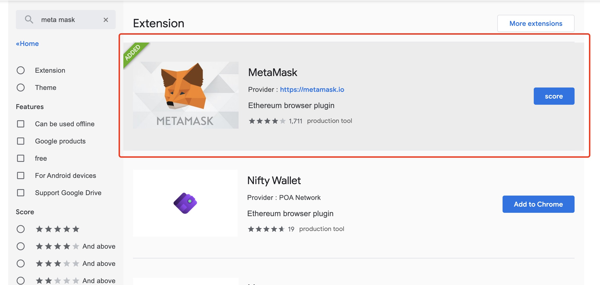
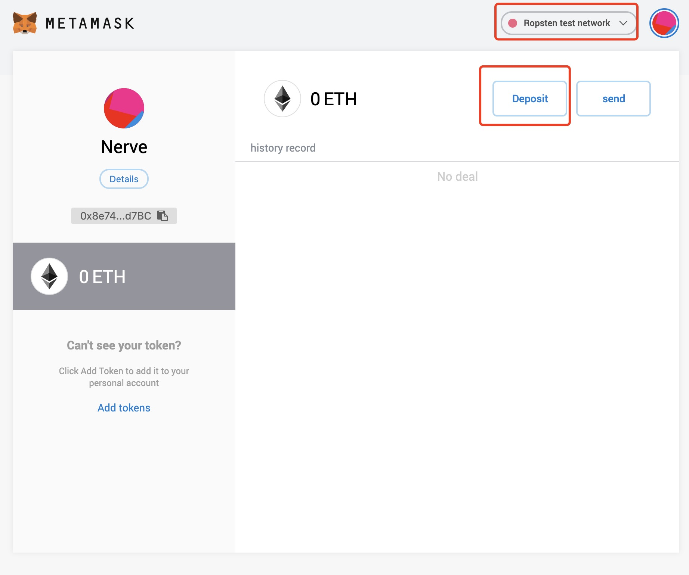
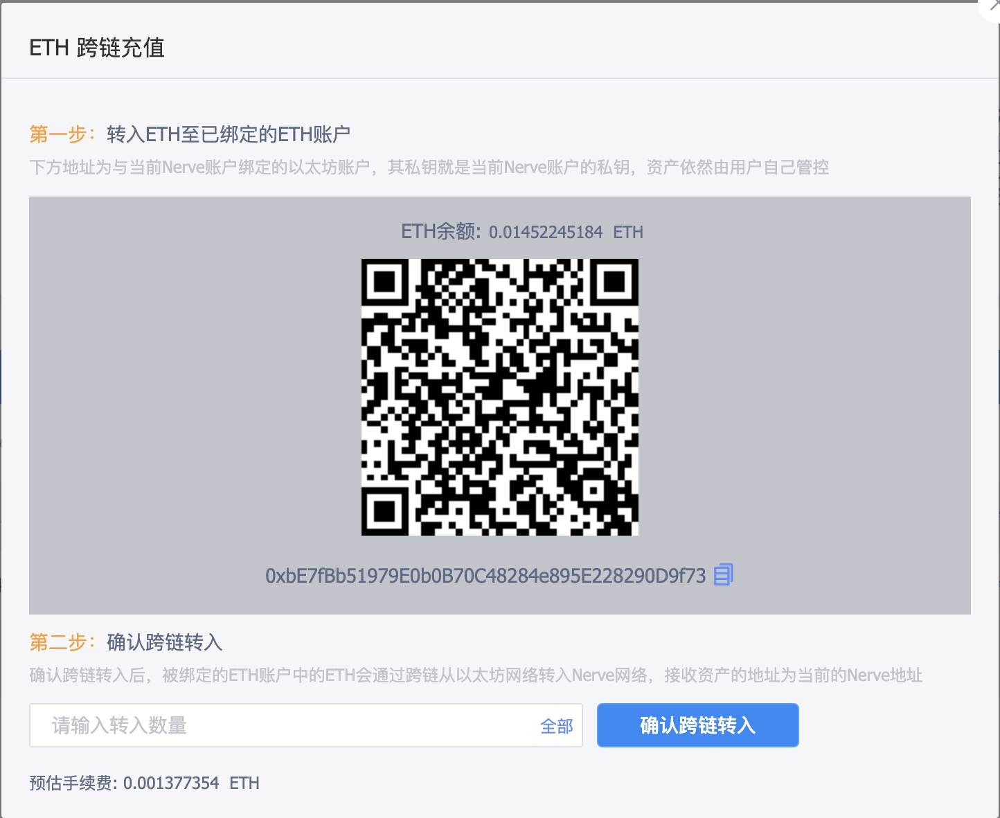
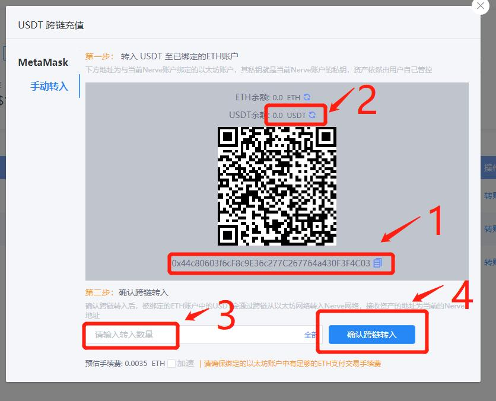

# Nerve网页钱包ETH资产跨链

目前Nerve网络已经支持ETH资产跨链

## 准备ETH资产（USDT为例）
访问Chrome的[应用商店](https://chrome.google.com/webstore/search/meta%20mask?utm_source=chrome-ntp-icon)，找到Meta mask，安装插件

MateMask安装成功之后，导入或创建ETH地址，选择主网

向创建的地址转入USDT（预留ETH做手续费）或者导入地址已有USDT。

## 将USDT转入Nerve网络

进入Nerve的[网页钱包](https://wallet.nerve.network/)，在转账页面，找到USDT，点击【跨链转入】，即可看到入口，跨链转入两种方式：MateMask转入和手动转入（地址充值）

一、MateMask转入

连接MateMask，MateMask解锁授权

1、转入ERC20资产需要先授权

2、输入转入USDT数量（不大于可用）

3、点击“确认跨链转入”，然后在MateMask上面确认交易

完成上述操作之后，等待几分钟就可以在Nerve网页钱包查看USDT余额。

二、手动转入

**第一步：**将USDT转入已绑定的以太坊账户（每个Nerve地址都有一个配对的以太坊账户，该账户的私钥为Nerve账户的私钥，因此以太坊账户资产依然由用户自己管控）

1、 复制地址，作为接收地址，向该地址转入USDT（该账户需要预留**ETH作为手续费**）

2、等待USDT余额显示已经转入绑定的以太坊地址

**第二步：** 确认跨链转入（可以将以太坊账户的私钥直接导入Nerve网页钱包，手动转入页面将显示该地址的ETH和USDT，省略第一步，节约一次手续费）

3、输入转入Nerve钱包的USDT数量（不大于USDT余额）

4、点击“确认跨链转入”，输入密码确认

完成上述操作之后，等待几分钟就可以在Nerve网页钱包查看USDT余额

> Tips：如果跨链转入的是ERC20资产，需要注意绑定的以太坊账户中是否有足够的ETH支付交易手续费（跨链转账也需要在以太坊网络打包交易，因此需要消耗ETH）

