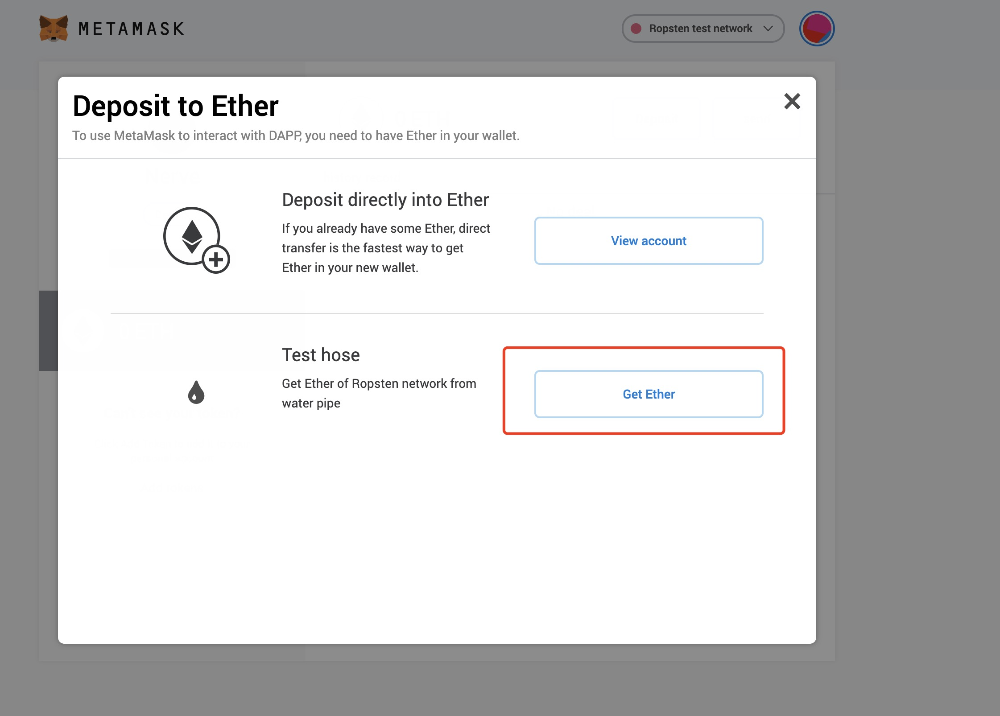
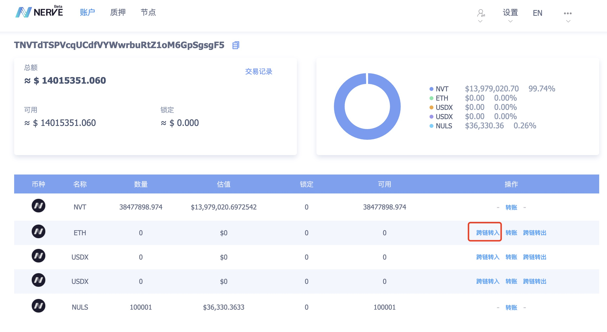

# ETH跨链

Nerve网络目前为Beta版本，因此接入的也是ETH的测试网络，因此请用户注意使用以太坊的测试网络向Nerve的测试网络进行跨链转账

## 准备ETH测试币
访问Chrome的[应用商店](https://chrome.google.com/webstore/search/meta%20mask?utm_source=chrome-ntp-icon)，找到Meta mask，然后创建一个以太坊账户

选择**Ropsten**测试网络，然后点击【转入】按钮

点击【获取Ether】，即可领取测试的ETH

## 将ETH转入Nerve网络

进入Nerve的[测试网轻钱包](http://beta.wallet.nerve.network/)，在转账页面，找到ETH，点击【跨链转入】，即可看到入口，跨链转入ETH将会分为两个步骤
点击【获取Ether】，即可领取测试的ETH

**第一步：** 将ETH转入已绑定的以太坊账户

每个Nerve地址都有一个配对的以太坊账户，该账户的私钥为Nerve账户的私钥，因此以太坊账户资产依然由用户自己管控

**第二步：** 确认跨链转入

在输入框输入需要转入的ETH数量后，发起交易，绑定的以太坊账户中的ETH会通过跨链从以太坊网络转入Nerve网络，接收资产的地址为当前的Nerve地址

> Tips：如果跨链转入的是ERC20资产，需要注意绑定的以太坊账户中是否有足够的ETH支付交易手续费（跨链转账也需要在以太坊网络打包交易，因此需要消耗ETH）

