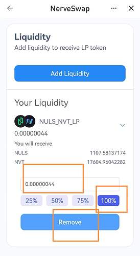

# 如何在NerveSwap添加流动性以及NerveFarm参与挖矿

**NerveNetwork在主网中支持NULS_NVT_LP,BTC_NVT_LP,BNB_NVT_LP,USDTN_NVT_LP质押产出共识奖励**

**除了主网质押以外，NerveSwap支持在NerveFarm参与质押产出Farm奖励**

## 【本篇以移动端Nabox钱包添加NULS-NVT LP质押为例】

### 1、登录[Nabox](https://nabox.io/)钱包(https://nabox.io/)；
### 2、在Nerve链上准备NVT和NULS资产；
### 3、进入NerveSwap添加流动性和农场质押挖矿：

* **点击【发现】→搜索【NerveSwap】→点击【生成L2地址】**
备注：第一次登陆账户时，会提示点击【生成L2地址】。

* **添加NVT_NULS LP流动性**

点击右侧菜单【流动性】→【增加流动性】→选择【NVT】→【输入NVT数量】→选择【NULS】→【匹配等值的NULS数量】→点击【确认】、输入密码。

添加成功后，你的LP数量即可显示。
#

#
* **将NVT_NULS LP质押在Farm挖矿**

点击右侧菜单【农场】→选择对应的农场交易对【NULS_NVT】→点击【+】→添加【LP数量】→点击【确认】、输入密码。

**至此，你就在NerveSwap的农场里开始质押挖矿了。**

### **4、如何退出Farm挖矿和LP流动性**

* **退出Farm质押**

点击右侧菜单【农场】→找到你质押中的交易对【NULS_NVT】，点击【-】→输入【LP退出数量】→点击【确认】、输入密码。

* **退出LP流动性**

点击右侧菜单【流动性】→找到你的LP→输入【LP退出数量100%】→点击【退出】→点击【确认】、输入密码。

农场质押和LP流动性退出后，资产会显示在Nabox钱包的NerveNetwork地址上。
