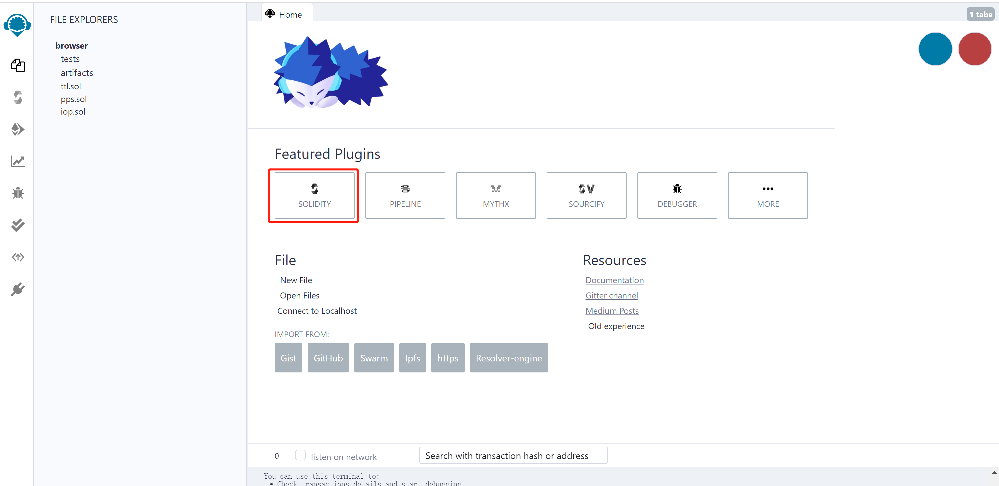
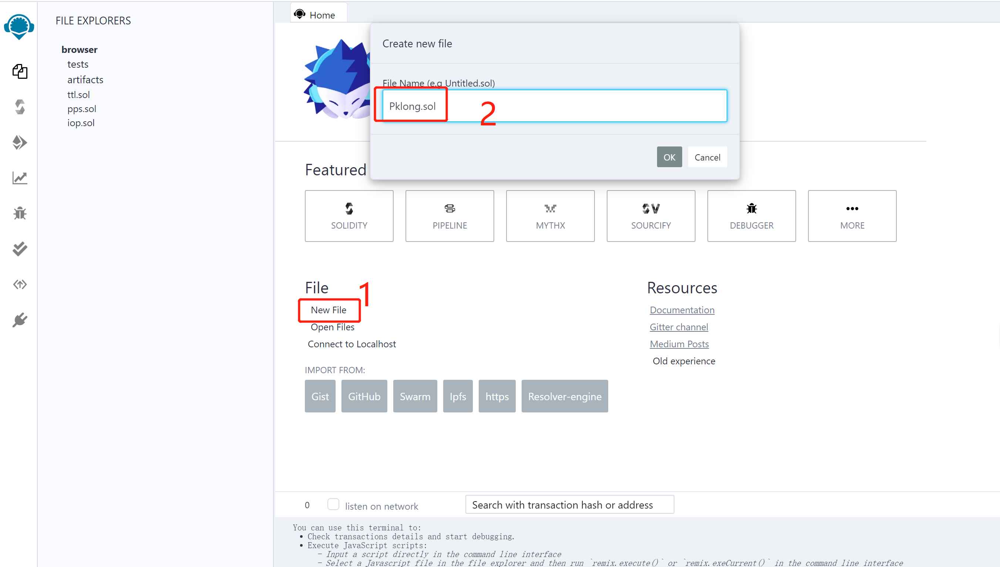
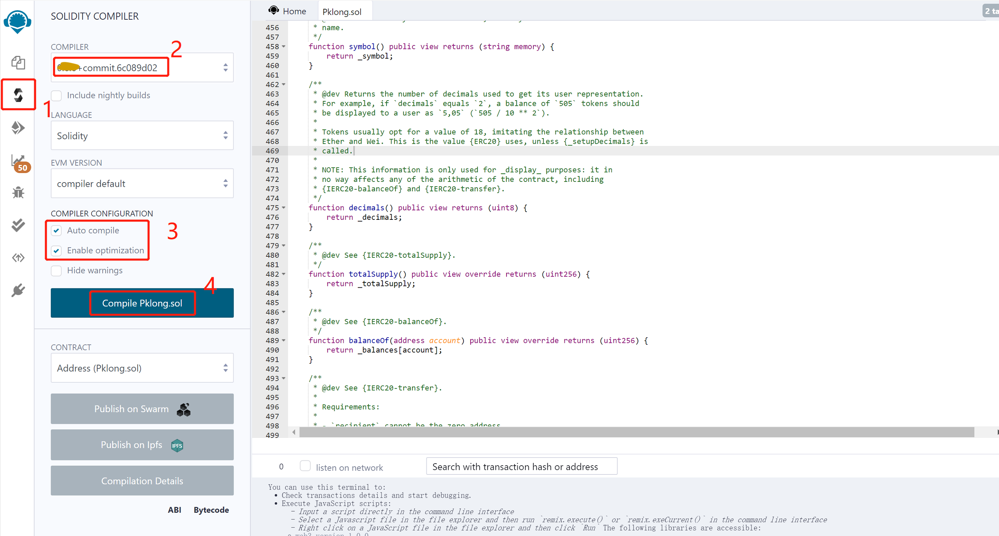
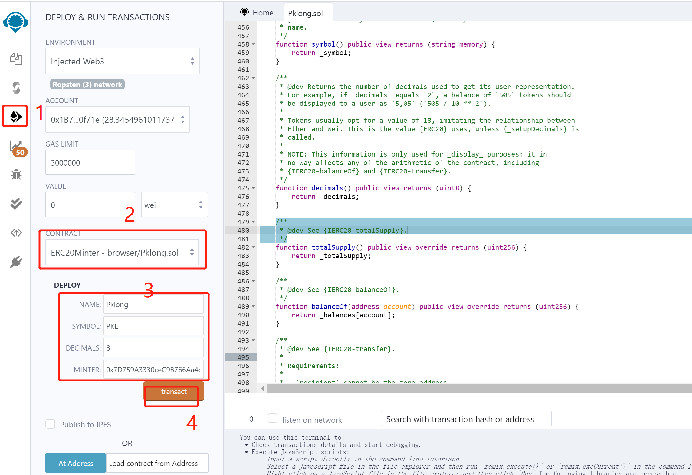

# NERVE资产跨链到ETH网络（BSC网络）

ETH网络合约和BSC网络合约创建时，只有MINTER参数不同，其他完全一样。（文中的ERC20在创建BSC合约时就是BEP20）

## 一 创建ERC20合约

- **注意1**：必须使用NERVE团队提供的[ERC20合约源代码](https://github.com/NerveNetwork/contracts/blob/master/ERC20Minter.sol) `ERC20Minter.sol`
- **注意2**：创建ERC20合约时，`decimals`必须与NERVE网络的资产的`decimals`一致

1、打开[以太坊智能合约在线开发工具](http://remix.ethereum.org/#optimize=true&evmVersion=null&version=soljson-v0.6.12+commit.27d51765.js)，选择SOLIDITY



2、创建文件



1. 点击“New File”
2. 创建一个新的sol文件

3、将NERVE团队提供的ERC20合约源代码复制进新建的文件中并保存（ctrl+s)

4、编译



1. 点击选择红框的图标
2. <b style="color:red">选择“0.6.12+commit.27d51765”，版本一定不能选错</b>
3. <b style="color:red">勾选红框内的两个多选框，一定要勾上</b>
4. 点击按钮

编译成功之后，需要导入ETH账户（有eth做手续费）（matemask导入过程略）

5、创建ERC20合约



1. 点击图标

2. 选择之前创建的Pklong.sol文件，一定要是ERC20Minter

3. 输入参数（NAME、SYMBOL、DECIMALS、MINTER）：其中NAME和SYMBOL原则上需要跟已创建的NRC20（NERVE资产）保持一致，DECIMALS必须跟已创建的NRC20（NERVE资产）保持一致；

   MINTER参数（ETH网络）

   测试网: 0x7D759A3330ceC9B766Aa4c889715535eeD3c0484

   正式网: 0x6758d4C4734Ac7811358395A8E0c3832BA6Ac624

   MINTER参数（BSC网络）

   BSC测试网: 0xf7915d4de86b856F3e51b894134816680bf09EEE
   
   BSC主网: 0x3758AA66caD9F2606F1F501c9CB31b94b713A6d5

   **注意** 在BSC网络上面注册合约跟ETH网络一样，只需要注意MINTER参数

4. 点击按钮，发起创建合约交易（通过matemask确认），交易发起确认之后，通过查询交易**获取ERC20合约地址**

## 二 申请绑定ERC20资产

按如下模版发送邮件至 `support@nerve.network`

```
Hi Nerve，

我是XXX项目，申请注册ERC20资产至Nerve网络，信息如下

ERC20合约地址：0x7b6f71c8b123b38aa8099e0098bec7fbc35b8a13
Nerve网络资产链ID和资产ID(assetChainId, assetId): 1-8    
```


## 三 等待反馈

Nerve技术团队收到邮件后，将进行如下操作，请等待反馈

- 在ETH多签合约中注册上述ERC20合约
- 在NERVE网络注册绑定ERC20合约至提供的NERVE资产

## 四 参考文档

- [将NRC20合约token跨链到NERVE网络](http://docs.nerve.network/zh/Guide/c_nrc20.html#%E5%88%9B%E5%BB%BA%E8%B7%A8%E9%93%BEtoken)

- [在NerveDEX创建交易对](http://docs.nerve.network/zh/Guide/c_nrc20.html#%E5%9C%A8nervedex%E4%B8%8A%E5%88%9B%E5%BB%BAnrc20-token%E4%BA%A4%E6%98%93%E5%AF%B9)

- [ID查询地址](https://scan.nerve.network/assets)