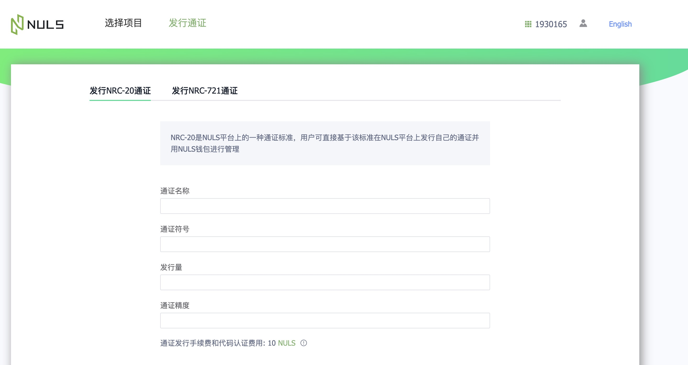

# NRC20上架DEX

## 发行NRC20
NULS提供了POCM平台：https://pocm.nuls.io/Token/NewToken 支持一键发行NRC20通证
> 测试网POCM地址:http://beta.pocm.nuls.io/

## NRC20跨链

当前NRC20通证的跨链，需要在[NULS钱包](http://wallet.nuls.io/)上调用智能合约进行操作，因此我们也编写了详细的[操作教程](./c_nrc20.md)

> NULS测试网钱包地址：http://beta.wallet.nuls.io/

后续我们也将提供更为友好的交互界面,方便不熟悉智能合约的用户也能简单操作

## 创建交易对

如果你想在NDEX上创建针对NRC20的交易对，进入NerverDEX的NervePad进行创建，详情参考：[NerveDEX上创建NRC20 token交易对](http://docs.nerve.network/zh/Guide/c_nrc20.html#%E5%9C%A8nervedex%E4%B8%8A%E5%88%9B%E5%BB%BAnrc20-token%E4%BA%A4%E6%98%93%E5%AF%B9)
